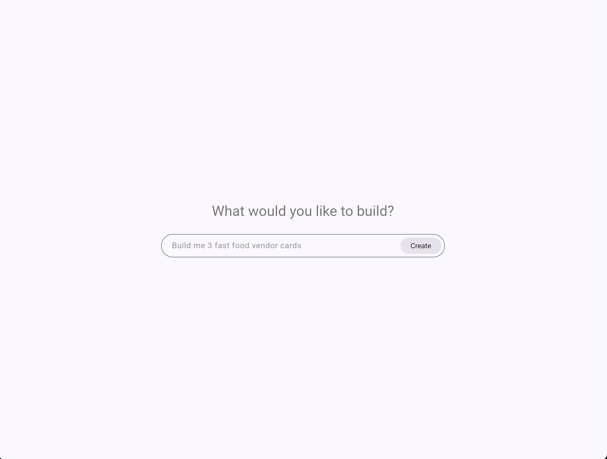

# agentic_client

A drop-in Flutter chat widget for [AG-UI](https://docs.ag-ui.com)-compatible
agent backends that renders the agent's generative-UI surfaces ([A2UI v0.9](https://a2ui.org))
inline using a [genui](https://pub.dev/packages/genui) catalog of your own
Flutter widgets.



## Features

- **One widget, full chat surface**: `AguiChat` owns the transport, the
  [`SurfaceController`][SurfaceController], and the conversation log; just give
  it a `baseUrl` and a `Catalog`.
- **Streamed assistant text** rendered as chat bubbles with a thinking
  indicator while a turn is in flight.
- **Generative UI inline** via three configurable ingest paths:
  1. **Tool-result envelope** (default): A2UI ops in `TOOL_CALL_RESULT.content`
     under an `a2ui_operations` array (the CopilotKit convention).
  2. **Ghost tool-call args** (`uiRenderToolNames`): the ops live in
     `TOOL_CALL_ARGS` for a synthetic UI-render tool; the client absorbs the
     call and synthesizes a tool result back into history. The same path
     picks up server-side UI patches emitted via LangGraph's
     `manually_emit_tool_call` custom event, so backends can refresh a
     surface without re-invoking the LLM.
  3. **Markdown fence intercept** (`markdownA2uiLangTag`): fenced code blocks
     with a configurable lang tag are stripped out of assistant text and
     parsed as A2UI ops.
- **Shared agent state** (`onStateChanged`): the client mirrors the agent's
  `state` via `STATE_SNAPSHOT` / `STATE_DELTA` (RFC 6902 JSON Patch). The
  backend is the source of truth: the mirror is read-only on the client and
  is round-tripped back as `SimpleRunAgentInput.state` so stateless agents
  can resume across runs. Wire `onStateChanged` to observe changes or
  render debug UIs over them.
- **UI interaction round-trip**: catalog buttons (and any other
  `UserActionEvent`-firing widgets) become an out-of-band action signal.
  The transport packs the action into `forwarded_props.pending_action` so
  your agent can handle it via a pre-LLM node or middleware without
  treating the click as a chat message.
- **Inline agent-event steps** (`showAgentEvents: true`): show small italic
  step rows like "Calling render_ui_widget…" / "Rendering 4 components" /
  "Updating data" as the agent works, instead of a single loader spinner.

[SurfaceController]: https://pub.dev/documentation/genui/latest/genui/SurfaceController-class.html

## Getting started

Prerequisites:

- Flutter `>=3.35.7` (Dart SDK `^3.12.2`).
- An AG-UI-compatible agent endpoint reachable over HTTP. The widget POSTs each
  turn to `"$baseUrl/"`.
- A2UI ops from the agent must travel inside `TOOL_CALL_RESULT.content` under
  the `a2ui_operations` envelope (the CopilotKit convention).

Add the package to your app's `pubspec.yaml`:

```yaml
dependencies:
  agentic_client: ^0.0.1
  genui: ^0.9.2
```

## Usage

Build a [`Catalog`][Catalog] of the widgets your agent is allowed to render,
then drop `AguiChat` into any `Scaffold`:

```dart
import 'package:agentic_client/agentic_client.dart';
import 'package:flutter/material.dart';
import 'package:genui/genui.dart';

class ChatScreen extends StatelessWidget {
  const ChatScreen({super.key});

  @override
  Widget build(BuildContext context) {
    return Scaffold(
      appBar: AppBar(title: const Text('Chat')),
      body: AguiChat(
        baseUrl: 'http://localhost:8123',
        catalog: Catalog(
          [
            BasicCatalogItems.text,
            BasicCatalogItems.column,
            BasicCatalogItems.row,
            // …plus your own CatalogItems
          ],
          catalogId: 'my-app.catalog',
        ),
        catalogDescription: '... optional A2UI prompt context ...',
        hintText: 'Ask me anything…',

        // Optional A2UI ingest paths (enable on top of the always-on
        // tool-result envelope).
        uiRenderToolNames: const {'render_ui_widget', 'emit_ui_update'},
        markdownA2uiLangTag: 'a2ui',

        // Observe shared state. Fires on STATE_SNAPSHOT and STATE_DELTA.
        // The backend is the source of truth; the map is a fresh copy on
        // every call.
        onStateChanged: (state) {
          // e.g. setState(() => _agentState = state);
        },

        // Inline step rows ("Calling …", "Rendering 4 components",
        // "Updating data") instead of a single loader spinner.
        showAgentEvents: true,
      ),
    );
  }
}
```

`catalogDescription` is shipped to the agent on every request via the AG-UI
`context` field. Use it to teach the model the wire format and the props each
of your components accepts. For fixed-schema backends (where the agent's tool
already knows the catalog), leave it `null`.

### Shared state and UI actions

When you wire `onStateChanged`, the client mirrors the agent's shared state
via `STATE_SNAPSHOT` / `STATE_DELTA` (RFC 6902 JSON Patch) and echoes the
mirror back as `SimpleRunAgentInput.state` on every turn. The mirror is
read-only on the client; the backend owns all writes.

When a user taps an A2UI `Button` (or any widget that fires a
`UserActionEvent`), the transport packs the action into
`forwarded_props.pending_action` instead of treating it as a chat message.
A backend pre-LLM hook can read `state["pending_action"]`, mutate state,
and either short-circuit the graph (silent) or inject a synthetic
`HumanMessage` (chatty).

For backends that need to refresh a surface without invoking the LLM (for
example, after a silent state mutation), dispatch a LangGraph custom event
named `manually_emit_tool_call` with `args` set to a JSON-encoded
`{"a2ui_operations": [...]}` envelope and the tool name registered in
`uiRenderToolNames`. The client unwraps the envelope and applies the ops
to the surface, so components with `{"path": "/..."}` bindings update in
place.

A complete runnable app, including custom `ProductCard`, `WeatherTile` and
`Stat` catalog items, lives in [`/example`](example/). Run it against any
AG-UI agent with:

```sh
cd example
flutter run --dart-define=AGENT_URL=http://localhost:8123
```

[Catalog]: https://pub.dev/documentation/genui/latest/genui/Catalog-class.html

## Additional information

- Built on top of [`ag_ui`](https://pub.dev/packages/ag_ui) for transport and
  [`genui`](https://pub.dev/packages/genui) for A2UI surface rendering.
- Issues and contributions are welcome on the repository.
