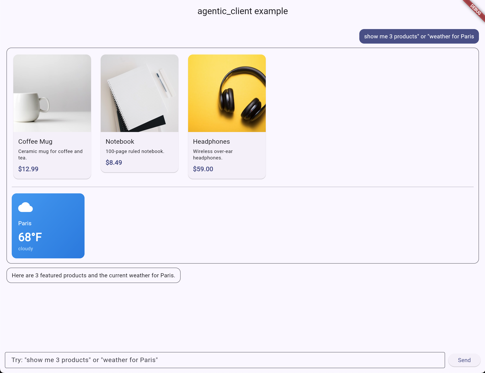

# agentic_client

A drop-in Flutter chat widget for [AG-UI](https://docs.ag-ui.com)-compatible
agent backends that renders the agent's generative-UI surfaces ([A2UI v0.9](https://a2ui.org))
inline using a [genui](https://pub.dev/packages/genui) catalog of your own
Flutter widgets.



## Features

- **One widget, full chat surface** — `AguiChat` owns the transport, the
  [`SurfaceController`][SurfaceController], and the conversation log; just give
  it a `baseUrl` and a `Catalog`.
- **Streamed assistant text** rendered as chat bubbles with a thinking
  indicator while a turn is in flight.
- **Generative UI inline** — A2UI surfaces emitted by the agent (tagged inside
  AG-UI `TOOL_CALL_RESULT` events) are unpacked and rendered with the catalog
  widgets you provide.
- **Themed from the host** — bubbles, input field and send button read from
  `Theme.of(context)`, so the widget inherits whatever `MaterialApp` theme you
  hand it.
- **Conversation history is replayed** on every turn, so stateless backends
  still see the full prior context.

[SurfaceController]: https://pub.dev/documentation/genui/latest/genui/SurfaceController-class.html

## Getting started

Prerequisites:

- Flutter `>=3.35.7` (Dart SDK `^3.12.2`).
- An AG-UI-compatible agent endpoint reachable over HTTP. The widget POSTs each
  turn to `"$baseUrl/"`.
- A2UI ops from the agent must travel inside `TOOL_CALL_RESULT.content` under
  the `a2ui_operations` envelope (the CopilotKit convention).

Add the package to your app's `pubspec.yaml`:

```yaml
dependencies:
  agentic_client: ^0.0.1
  genui: ^0.9.2
```

## Usage

Build a [`Catalog`][Catalog] of the widgets your agent is allowed to render,
then drop `AguiChat` into any `Scaffold`:

```dart
import 'package:agentic_client/agentic_client.dart';
import 'package:flutter/material.dart';
import 'package:genui/genui.dart';

class ChatScreen extends StatelessWidget {
  const ChatScreen({super.key});

  @override
  Widget build(BuildContext context) {
    return Scaffold(
      appBar: AppBar(title: const Text('Chat')),
      body: AguiChat(
        baseUrl: 'http://localhost:8123',
        catalog: Catalog(
          [
            BasicCatalogItems.text,
            BasicCatalogItems.column,
            BasicCatalogItems.row,
            // …plus your own CatalogItems
          ],
          catalogId: 'my-app.catalog',
        ),
        catalogDescription: '... optional A2UI prompt context ...',
        hintText: 'Ask me anything…',
      ),
    );
  }
}
```

`catalogDescription` is shipped to the agent on every request via the AG-UI
`context` field — use it to teach the model the wire format and the props each
of your components accepts. For fixed-schema backends (where the agent's tool
already knows the catalog), leave it `null`.

A complete runnable app, including custom `ProductCard`, `WeatherTile` and
`Stat` catalog items, lives in [`/example`](example/). Run it against any
AG-UI agent with:

```sh
cd example
flutter run --dart-define=AGENT_URL=http://localhost:8123
```

[Catalog]: https://pub.dev/documentation/genui/latest/genui/Catalog-class.html

## Additional information

- Built on top of [`ag_ui`](https://pub.dev/packages/ag_ui) for transport and
  [`genui`](https://pub.dev/packages/genui) for A2UI surface rendering.
- Issues and contributions are welcome on the repository.
